<div align="center">

# Hi there, I'm Sangam Chaurasiya 👋

[](https://github.com/sangamchaurasiya65)
[](https://linkedin.com/in/sangam-chaurasiya)
[](mailto:chaurasiyarajesh931@gmail.com)

---

<!-- Live Terminal Banner with Adaptive Dark/Light Mode -->
<picture>
  <source media="(prefers-color-scheme: dark)" srcset="dark.svg">
  <source media="(prefers-color-scheme: light)" srcset="light.svg">
  
</picture>

---

</div>

## 🚀 About Me

```zsh
> sangam.details
{
  "name": "Sangam Chaurasiya",
  "role": "Student",
  "location": "India",
  "education": "B.Tech",
  "status": "Building + Learning + Shipping",
  "focus": ["Full-Stack Engineering", "Mobile Development", "Cloud Systems"]
}
```

---

## 🛠️ Tech Stack & Tooling

<div align="center">

### Languages


### Frontend & Mobile


### Backend & Databases


### DevOps & Tools


</div>

---

## 📬 Connect With Me

- 💼 **LinkedIn**: [in/sangam-chaurasiya](https://linkedin.com/in/sangam-chaurasiya)
- 🐙 **GitHub**: [@sangamchaurasiya65](https://github.com/sangamchaurasiya65)
- 📷 **Instagram**: [@sangamchaurasiya5614](https://instagram.com/sangamchaurasiya5614)
- 📧 **Email**: [chaurasiyarajesh931@gmail.com](mailto:chaurasiyarajesh931@gmail.com)

---

<div align="center">
  <sub>Generated with pure SMIL vector animation • 100% XML valid SVG</sub>
</div>